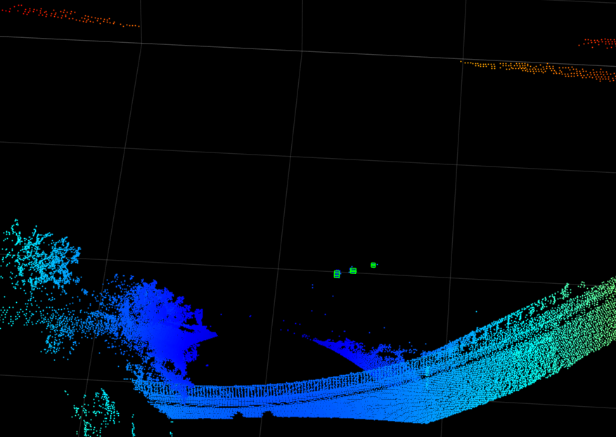
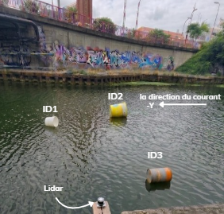
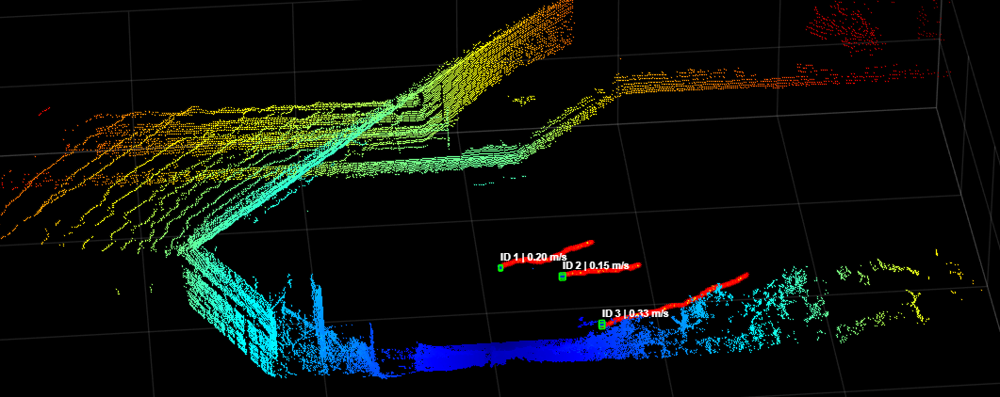
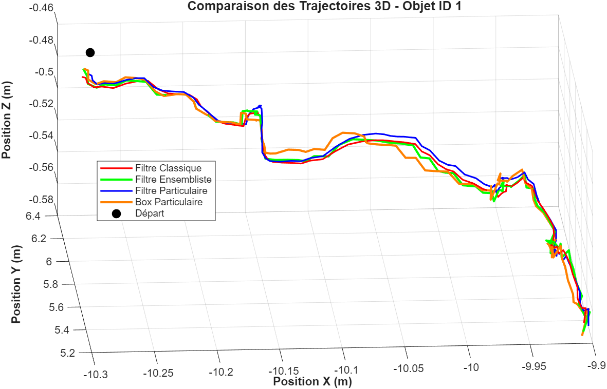

# Detection and Tracking of Floating Marine Debris Using a 3D LiDAR

Master's thesis project (Master ISC, Université du Littoral Côte d'Opale), carried out at the **LISIC laboratory (UR 4491), EDyFI team**, March–September 2026.

The goal is to detect and track floating debris on the water surface with a 3D LiDAR (Ouster OS1-128) and its built-in IMU, and to compare **four state estimation filters**, probabilistic and set-membership (interval-based), on the same real data acquired on the Calais canal.
The project exists in two versions with the same algorithms and parameters:  **MATLAB** code (repository root) and a **Python** port (`python/` folder) that runs without a MATLAB license or INTLAB.


## Pipeline

```
LiDAR + IMU  ->  Tilt correction  ->  Region of interest  ->  Radial segmentation  ->  3D bounding boxes  ->  Multi-object tracking
 (Ouster)        (roll / pitch)       (water area only)       (range image, ρ)         (box centers)          (4 filters)
```

1. **Tilt correction**: roll and pitch are estimated from the IMU accelerometer, then the point cloud is rotated into the world frame at every frame.
2. **Region of interest**: only the part of the scan facing the water is kept, which reduces the number of points and removes the quay.
3. **Radial segmentation**: the range matrix ρ (128 × 512) is processed as a depth image. A jump between neighbouring cells larger than an adaptive threshold τ = max(ε, 1.5 μ) marks the edge of an object. Regions are then closed (3×3) and labelled (8-connectivity).
4. **Bounding boxes**: one axis-aligned 3D box per object; its center is the measurement sent to the tracker.
5. **Multi-object tracking**: constant-acceleration model (9 states: position, velocity, acceleration), Mahalanobis gating (d_M < 3.5) and nearest-neighbour association.

## The four filters

| Filter | Family | Uncertainty representation | MATLAB file | Python file |
| --- | --- | --- | --- | --- |
| Kalman filter | Probabilistic (Gaussian) | Mean + covariance | `kalman_classique.m` | `kalman_classique.py` |
| Particle filter | Probabilistic (Monte-Carlo) | Weighted particles + resampling | `filtre_particule.m` | `filtre_particule.py` |
| UBIKF (Upper Bound Interval Kalman Filter) | Set-membership | State box + upper bound of the covariance | `kalman_ensembliste.m` | `kalman_ensembliste.py` |
| Box Particle Filter | Set-membership (Monte-Carlo) | Weighted boxes + subdivision resampling | `filtre_particule_boite.m` | `filtre_particule_boite.py` |

## Results (Calais canal, 3 floating objects)

<table>
  <tr>
    <td align="center"><br><em>Three floating objects on the Calais canal</em></td>
    <td align="center"><br><em>Detection and tracking: each object keeps its box and its ID</em></td>
  </tr>
</table>

| Filter | Mean number of tracks | Mean cardinality error | Frames with exact count |
| --- | --- | --- | --- |
| Kalman | 3.04 | 0.10 | 92.1 % |
| Particle filter | 2.94 | 0.06 | 98.1 % |
| UBIKF | 2.94 | 0.06 | 98.1 % |
| Box Particle Filter | 2.96 | 0.07 | 96.8 % |

All four filters estimate drift speeds between 0.12 and 0.25 m/s, consistent with the current measured on site (about 0.15 m/s).



## Repository structure

```
├── main.m                      # Kalman filter or UBIKF (choose at the top of the file)
├── Detect_particule.m          # Particle filter or Box Particle Filter (choose at the top of the file)
├── correct_inclinaison.m       # Tilt correction with the IMU
├── segmentation_rho_marin.m    # Radial segmentation and bounding boxes
├── kalman_classique.m          # Kalman filter
├── kalman_ensembliste.m        # UBIKF
├── filtre_particule.m          # Particle filter
├── filtre_particule_boite.m    # Box Particle Filter
├── sauvegarde.m                # Saves the results of a run (.mat)
├── plot_figure.m               # Compares the four filters from the saved .mat files
├── docs/                       # Figures, report and slides
└── python/                     # Python version (same scripts, same functions)
    ├── main.py                 # Same role as main.m
    ├── detect_particule.py     # Same role as Detect_particule.m
    ├── sauvegarde.py           # Same role as sauvegarde.m
    ├── plot_figure.py          # Same role as plot_figure.m
    ├── generer_donnees_test.py # Creates a simulated Ouster recording for testing
    ├── requirements.txt        # Python packages
    ├── suivi_lidar/            # Functions: reading, tilt correction, ROI, segmentation, filters, intervals, figures, 3D viewer
    └── tests/                  # Automated tests (pytest)
```

## Requirements (MATLAB version)

- MATLAB (developed with R2024b)
- Lidar Toolbox (reading Ouster `.pcap` files with `ousterFileReader`)
- Image Processing Toolbox (morphological closing, connected-component labelling)
- [INTLAB](https://www.tuhh.de/ti3/rump/intlab/) for interval computations (UBIKF and Box Particle Filter), not included in this repository

## How to run (MATLAB version)

1. Install INTLAB and add it to the MATLAB path.
2. Put the acquisition files (`3objets.pcap` and `3objets.json`) in the project folder. The raw LiDAR recordings are not included in this repository because of their size.
3. Run `main.m` for the Kalman filter or the UBIKF, or `Detect_particule.m` for the particle filter or the Box Particle Filter. The filter is selected by the `CHOIX_FILTRE` variable at the top of each script.
4. Run `sauvegarde.m` to save the results, then `plot_figure.m` to compare the four filters.

## Python version

The `python/` folder contains a complete Python port of the MATLAB code. The four scripts keep the names and roles of the MATLAB scripts, each filter is still one function per file, and all the settings of the final MATLAB code are gathered in `suivi_lidar/parametres.py`. The MATLAB toolboxes are replaced by open-source libraries.

| MATLAB | Python |
| --- | --- |
| Lidar Toolbox: `ousterFileReader`, `readFrame`, `readIMU` | [Ouster SDK](https://pypi.org/project/ouster-sdk/) |
| Lidar Toolbox: `pcplayer`, `showShape` | [Open3D](https://www.open3d.org/) |
| Image Processing Toolbox: `imclose`, `bwlabel` | SciPy (`scipy.ndimage`) |
| INTLAB | `suivi_lidar/intervalles.py` (interval arithmetic with outward rounding) |
| `save` / `load` (.mat files) | SciPy (`scipy.io`), files remain readable by MATLAB |
| `figure`, `plot`, `movmean` | Matplotlib |

### Installation

Python 3.10 to 3.14 is required. In the `python/` folder:

```bash
python -m venv .venv
.venv\Scripts\activate          # Windows (macOS/Linux: source .venv/bin/activate)
pip install -r requirements.txt open3d
```

Install Open3D in the same command as the other packages, so that pip selects compatible versions for all of them. Open3D is only needed for the live 3D viewer; without it, run the scripts with `--sans-visu`.

### How to run

Put `3objets.pcap` and `3objets.json` in the `python/` folder (or give their paths with `--pcap` and `--json`), then:

```bash
python main.py                                   # Kalman filter (--filtre ENSEMBLISTE for the UBIKF)
python detect_particule.py                       # Particle filter (--filtre BOX_PARTICULAIRE for the BPF)
python sauvegarde.py --filtre tous --sans-visu   # Runs the four filters and saves the four .mat files
python plot_figure.py                            # Compares the four filters
```

Results (.mat files and PNG figures) are written to `python/resultats/`. Useful options: `--sans-visu` (no 3D viewer, faster), `--ne-pas-afficher` (saves the figures without opening windows), `--graine` (fixed random seed for the particle filters), `--premiere-trame` and `--trames-ignorees-fin` (frame window, 720 and 470 by default as in MATLAB).

### Testing without the real data

`generer_donnees_test.py` creates a simulated Ouster recording in the same format as the real one (canal, three drifting objects, splashes, wave occlusions, tilted sensor with its IMU):

```bash
python generer_donnees_test.py
python sauvegarde.py --filtre tous --pcap donnees_test/simulation.pcap --json donnees_test/simulation.json --premiere-trame 1 --trames-ignorees-fin 0
```

The automated tests (`pip install pytest`, then `python -m pytest`) check the interval arithmetic, the segmentation against a line-by-line translation of the MATLAB loops, the four filters and the whole chain on this simulated recording.

### Notes

- The particle filter and the Box Particle Filter draw random numbers, so their curves change slightly between MATLAB and Python, as between two MATLAB runs. The `--graine` option makes the Python results reproducible.
- On Windows, the Ouster SDK prints four "Duplicate metadata type" lines at startup. They come from the SDK itself and are harmless.

## References

- T. A. Tran, C. Jauberthie, L. Travé-Massuyès, Q. H. Lu, *An Interval Kalman Filter enhanced by lowering the covariance matrix upper bound*, International Journal of Applied Mathematics and Computer Science, 31(2), 2021.
- J. Xiong, C. Jauberthie, L. Travé-Massuyès, F. Le Gall, *Fault Detection using Interval Kalman Filtering enhanced by Constraint Propagation*, IEEE CDC, 2013.
- F. Abdallah, A. Gning, P. Bonnifait, *Box particle filtering for nonlinear state estimation using interval analysis*, Automatica, 44(3), 2008.
- S. M. Rump, *INTLAB – INTerval LABoratory*, Developments in Reliable Computing, 1999.

## Author

**Khalil Tarhda**, supervised by Régis Lherbier and Mohamed Fnadi (LISIC, Université du Littoral Côte d'Opale).
